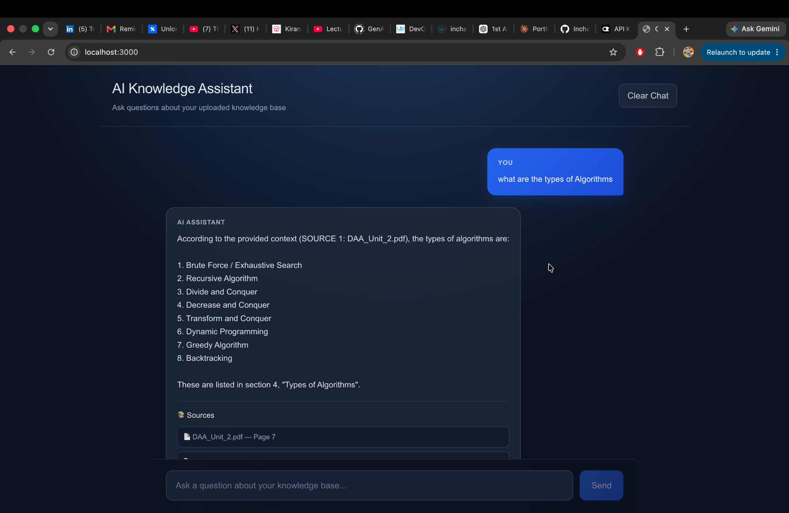

# 🤖 AI Knowledge Assistant

A production-oriented **Retrieval-Augmented Generation (RAG)** application that allows users to ask questions about their knowledge base and receive AI-generated answers backed by relevant document sources.

The system uses a hybrid retrieval pipeline combining **semantic search and BM25 keyword search**, followed by **cross-encoder reranking** and confidence-based retrieval validation.

---

## 🖥️ Application Preview



## ✨ Features

- 📄 Query PDF-based knowledge sources
- 🧠 Retrieval-Augmented Generation (RAG)
- 🔍 Semantic vector search using embeddings
- 🔎 BM25 keyword search
- 🔀 Hybrid retrieval using Reciprocal Rank Fusion (RRF)
- 🎯 Cross-encoder reranking for better relevance
- 📊 Confidence-based retrieval validation
- 🤖 AI-generated answers based on retrieved context
- 📚 Source citations with document names and page numbers
- 💬 Interactive chat interface
- 🐳 Dockerized application using Docker Compose

---

## 🏗️ Architecture

```text
                ┌──────────────────┐
                │     Next.js      │
                │    Frontend      │
                └────────┬─────────┘
                         │
                         │ Question
                         ▼
                ┌──────────────────┐
                │     FastAPI      │
                │ Retrieval Service│
                └────────┬─────────┘
                         │
                         ▼
          ┌─────────────────────────────┐
          │      Hybrid Retrieval       │
          │                             │
          │  Semantic Search + BM25     │
          └──────────────┬──────────────┘
                         │
                         ▼
                ┌──────────────────┐
                │   RRF Fusion     │
                └────────┬─────────┘
                         │
                         ▼
                ┌──────────────────┐
                │ Cross-Encoder    │
                │   Reranking      │
                └────────┬─────────┘
                         │
                         ▼
                ┌──────────────────┐
                │   Confidence     │
                │    Validation    │
                └────────┬─────────┘
                         │
                         ▼
                ┌──────────────────┐
                │       LLM        │
                │    Generation    │
                └──────────────────┘
```

---

## 🛠️ Tech Stack

### Frontend

- Next.js 14
- React
- TypeScript
- CSS

### Backend

- FastAPI
- Python

### Retrieval & AI

- ChromaDB
- Sentence Transformers
- BM25
- Cross-Encoder Reranking
- Hybrid Retrieval
- Reciprocal Rank Fusion (RRF)

### Infrastructure

- Docker
- Docker Compose

---

## 📂 Project Structure

```text
ai-knowledge-assistant/
│
├── frontend/                  # Next.js frontend
│
├── retrieval-service/         # FastAPI retrieval service
│   ├── app/
│   │   ├── chunking/
│   │   ├── embeddings/
│   │   ├── keyword_search/
│   │   ├── pipeline/
│   │   ├── reranking/
│   │   ├── retrieval/
│   │   └── vector_store/
│
├── data/
│   ├── documents/             # Source PDFs
│   └── processed/             # Processed document data
│
├── config/
├── eval/
│
├── docker-compose.yml
└── README.md
```

---

## 🔄 Retrieval Pipeline

When a user asks a question, the system follows this process:

1. **User submits a question** through the Next.js chat interface.
2. The question is sent to the **FastAPI retrieval service**.
3. The system performs **semantic vector search** using ChromaDB.
4. **BM25 keyword search** retrieves keyword-relevant chunks.
5. Results are combined using **Reciprocal Rank Fusion (RRF)**.
6. A **cross-encoder reranker** ranks the retrieved chunks by relevance.
7. A **confidence check** determines whether sufficient evidence exists.
8. If sufficient evidence is found, relevant context is passed to the LLM.
9. The system generates an answer grounded in the retrieved documents.
10. The frontend displays the answer along with its **document sources and page numbers**.

---

## 🚀 Running the Project

### Prerequisites

Make sure you have installed:

- Docker
- Docker Compose

### Clone the Repository

```bash
git clone <your-repository-url>
cd ai-knowledge-assistant
```

### Configure Environment Variables

Create a `.env` file based on `.env.example`:

```bash
cp .env.example .env
```

Example:

```env
RETRIEVAL_SERVICE_URL=http://localhost:8000
```

### Start the Application

```bash
docker compose up --build
```

Once running:

- Frontend: `http://localhost:3000`
- Retrieval API: `http://localhost:8000`

---

## 💬 Example Questions

You can ask questions such as:

- What is sequential search?
- Explain Euclid's algorithm for finding GCD.
- What is Big O notation?
- What are the types of algorithms?
- Explain bubble sort.

The system retrieves relevant information from the knowledge base before generating an answer.

---

## 📚 Source Grounding

The assistant is designed to answer questions using information retrieved from the provided knowledge base.

If the system cannot find sufficiently relevant information, it can refuse to provide an unsupported answer rather than hallucinating information.

This behavior is controlled using retrieval confidence validation after reranking.

---

## 🐳 Docker Services

The application consists of two services:

### Frontend

- Next.js application
- Runs on port `3000`

### Retrieval Service

- FastAPI application
- Handles retrieval, reranking, confidence validation, and answer generation
- Runs on port `8000`

Docker Compose handles communication between both services.

---

## 🎯 Current Capabilities

✅ PDF document processing  
✅ Document chunking  
✅ Vector embeddings  
✅ ChromaDB vector storage  
✅ Semantic retrieval  
✅ BM25 keyword retrieval  
✅ Hybrid search  
✅ Reciprocal Rank Fusion  
✅ Cross-encoder reranking  
✅ Retrieval confidence validation  
✅ LLM answer generation  
✅ Source citations  
✅ Next.js chat interface  
✅ Dockerized deployment  

---

## 🔮 Future Improvements

- Support uploading documents through the UI
- Conversation memory
- Streaming responses
- Evaluation metrics for retrieval quality
- Authentication and user accounts
- Multiple knowledge bases
- Improved citation highlighting
- Production deployment

---

## 👩‍💻 Author

**Inchara N K**

---

⭐ If you found this project interesting, consider giving the repository a star!